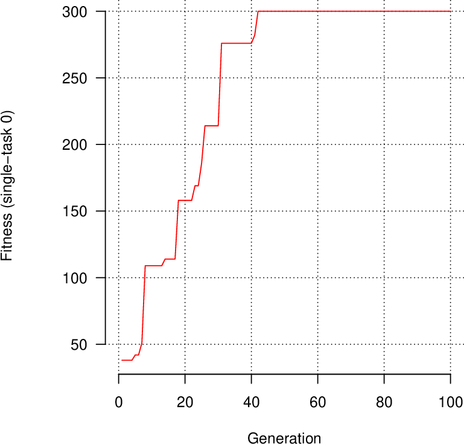

# Tangled Program Graphs (TPG)
This code reproduces results from the paper: 

Stephen Kelly, Tatiana Voegerl, Wolfgang Banzhaf, and Cedric Gondro. Evolving Hierarchical Memory-Prediction Machines in Multi-Task Reinforcement Learning. Genetic Programming and Evolvable Machines, 2021. [pdf](https://rdcu.be/czd3s)

## Quick Start

### 1. Install required software
This code is designed to be used in Linux. From the tpg directory run:
```
sudo xargs --arg-file requirements.txt apt install
```

### 2. Set environment variables.
In order to easily access tpg scripts, we must add appropriate folders to the $PATH environment variable.
To do so, add the following to *~/.profile*
```
export TPG_PATH=<YOUR_PATH_HERE>/tpg
export PATH=$PATH:$TPG_PATH/scripts/plot
export PATH=$PATH:$TPG_PATH/scripts/run
```
Then run:
```
source ~/.profile
```

### 3. Compile
From the tpg directory run:
```
scons --opt
```

### 4. Run an experiment
The folder tpg/classic_control_example contains scripts to evolve policies for classic control tasks. Parameters are set in parameters.txt. The default settings will evolve a policy for the [CartPole](https://gymnasium.farama.org/environments/classic_control/cart_pole/) task.

To run an experiment using 4 parallel MPI processes, make tpg/classic_control_example your working directory and run:
```
tpg-run-mpi.sh -n 4
```

### 5. Plot results
```
tpg-plot-stats.sh
```
This should produce classic_control_p0.pdf with various statistics. The first page will be a training curve looking something like the plot below. A fitness of 300 indicates the agent balances the pole for 300 timesteps, thus solving the task.




