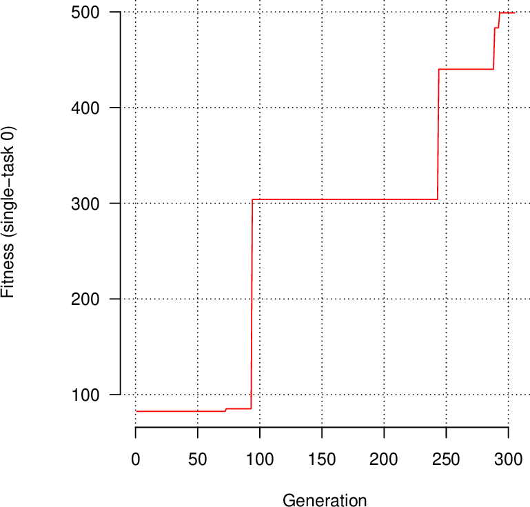

# Tangled Program Graphs (TPG)
This code reproduces results from the paper: 

- Tanya Djavaherpour, Ali Naqvi, Fatemeh Norouziani, Quentin Vacher, Stephen Kelly. Genetic Encoding and Shared Knowledge in Reinforcement Learning with Structured Memory, ALife 2025. [pdf](https://watermark02.silverchair.com/isal.a.858.pdf?token=AQECAHi208BE49Ooan9kkhW_Ercy7Dm3ZL_9Cf3qfKAc485ysgAAA0QwggNABgkqhkiG9w0BBwagggMxMIIDLQIBADCCAyYGCSqGSIb3DQEHATAeBglghkgBZQMEAS4wEQQMvYf9PdGInqH_P7HiAgEQgIIC92bvxLKcneXwLKfMXatEkr1-OsvAHu9YaRG6YeObf4CPU9mrdLMVci3woOI1SbgIq8eCYODYMFQvbCP-huCXH0aaDwIDngbkZoWgIVGg-P5LVsWTX6hRwKUjMtJr9AV9kAJ0rRJNLEuQkQAXAGNAuarKT1-i0XL6ZsCkF2O3jbJdVpKPgv5GUbKpJtsekYII0cMzAbegZ0-TNKv5RysiIHZndDlWbQ5Aad22exZW6o7FRXFdLJ4W4ramFRMT31-E1ogbU4pgx7ryVgapesjF_OyYO6RKWa3cCQjyO20yIgRWFC1jm6wZUYrvCngFGRhjQ5qHwPpJqsdUFkLBCHR2_xPHQtTeSsyMp3zqhrQYUwlj2VUTNoZNCx3Rsy4aZP2diwfKmCWkAAxb4wWGG64uju6bSj0s9uDTLp4el2G-JEJuMZi2OEHSUoY5g4lhT326jrws8XTiFkpuJXGA-jKeF0kg8UBhv5ppLfg-nRgz0tQsLVnN44hESWmddKtld_fctJXk0Td_6q6v72ulqBbeegOtYzYQBtaCDmWKZEMSNLmu24lpqTOAgPLLA4CKKvCT14iA6s5vEtnjHxEynP1V8diCzpl3s0FxIh4HYT12mPZMQeh-olR9gwEJSeczEGnorilmZVvDO1Dk3zXkybgSHnr4i5Wdo5_T1bHmT54dyhjI2O_S0Yp92wWFEoVR-7T891LTRgpLAboOsaMotaACZvYEAgpvMN0fS4eYNuT6_CoVga_F81HlGlCT8H-KBNrjIiHJ0QO_hiin59ejp4ly3f40Rx7-gPM02lyC5xu-RuCvr0g-njxcPwtps9hPNfkC_WmVliUCV6oDhOXBvm_ZpdT7jZ6uY_YIn4rxJF-ZP6ob1YLgeBlua5WB7fgH-zq2IviCo4-6lJxfub_CVdA-5GukwJray9NJ32etKigVw-LoGRQVq7y9L5UoI41F5PE27RHKXMBcjS68fvmSjCpzchfCtUqnqEMAwKd9RcoYeLGa5X_i3rlGMw)

The base TPG implementation is from the paper:

- Stephen Kelly, Tatiana Voegerl, Wolfgang Banzhaf, and Cedric Gondro. Evolving Hierarchical Memory-Prediction Machines in Multi-Task Reinforcement Learning. Genetic Programming and Evolvable Machines, 2021. [pdf](https://rdcu.be/czd3s)

- For the latest versions of the TPG project, please visit [Creative Algorithms Lab's GitLab page](https://gitlab.cas.mcmaster.ca/kellys32/tpg).

## Quick Start
This code is designed to be used in Linux. If you use Windows, you can use Windows Subsystem for Linux (WSL). You can work with WSL in Visual Studio Code by following [this tutorial](https://code.visualstudio.com/docs/remote/wsl-tutorial).

### 1. Install required software
From the tpg directory run:
```
sudo xargs --arg-file requirements.txt apt install
```
Note that [MuJoco](https://mujoco.org/) must be downloaded and unpacked separately.

### 2. Set environment variables
In order to easily access tpg scripts, we add appropriate folders to the $PATH environment variable.
To do so, add the following to *~/.profile*
```
export TPG=<YOUR_PATH_HERE>/tpg
export PATH=$PATH:$TPG/scripts/plot
export PATH=$PATH:$TPG/scripts/run
export MUJOCO=<YOUR_PATH_TO_MUJOCO>/mujoco-3.2.2
export LD_LIBRARY_PATH=$LD_LIBRARY_PATH:$MUJOCO/lib/
```
Then run:
```
source ~/.profile
```

### 3. Compile
From the tpg directory run:
```
scons --opt
```

### 4. Run an experiment
The folder tpg/experiment_directories/classic_control contains scripts to evolve policies for classic control tasks. Parameters are set in parameters.txt. The default settings will evolve a policy for the [CartPole](https://gymnasium.farama.org/environments/classic_control/cart_pole/) task.

To run an experiment using 4 parallel MPI processes, make tpg/experiment_directories/classic_control your working directory and run:
```
tpg-run-mpi.sh -n 4
```

Note that as of right now, the number of assigned processes must be greater than the number of active tasks.

### 5. Plot results
Generate classic_control_p0.pdf with various statistics:
```
tpg-plot-stats.sh
```
The first page will be a training curve looking something like the plot below. A fitness of 500 indicates the agent balances the pole for 500 timesteps, thus solving the task.



### 6. Visualize the best policy's behaviour
Display an OpenGL animation of the single best policy interacting with the environment:
```
tpg-run-mpi.sh -m 1
```
 
### 7. Cleanup
Delete all checkpoints and output files:
```
tpg-cleanup.sh
```
